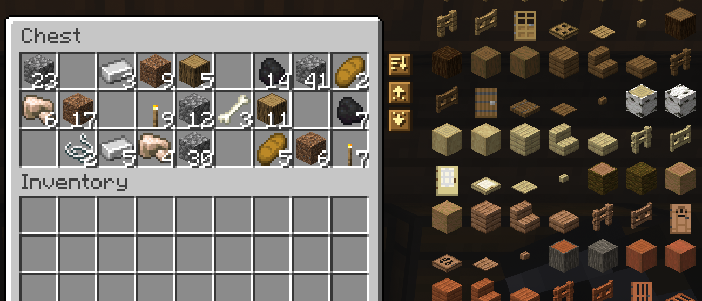

  

  <picture><source media="(prefers-color-scheme: dark)" srcset="https://shieldcn.dev/badge/Minecraft-1.21.11%20%C2%B7%2026.1.2%20%C2%B7%2026.2%20%C2%B7%2026.3-4ade80.svg?logo=lu:Pickaxe&amp;variant=secondary&amp;mode=dark" /></picture>
  <picture><source media="(prefers-color-scheme: dark)" srcset="https://shieldcn.dev/badge/Loaders-Fabric%20%C2%B7%20Forge%20%C2%B7%20NeoForge-5cd2ff.svg?logo=lu:Layers&amp;variant=secondary&amp;mode=dark" /></picture>
  <a href="https://modrinth.com/mod/amber"><picture><source media="(prefers-color-scheme: dark)" srcset="https://shieldcn.dev/badge/Requires-Amber-ebb134.svg?logo=lu:Gem&amp;variant=secondary&amp;mode=dark" /></picture></a>
  <a href="https://modrinth.com/mod/konfig"><picture><source media="(prefers-color-scheme: dark)" srcset="https://shieldcn.dev/badge/Requires-Konfig-a78bfa.svg?logo=lu:Settings2&amp;variant=secondary&amp;mode=dark" /></picture></a>
  <a href="LICENSE"><picture><source media="(prefers-color-scheme: dark)" srcset="https://shieldcn.dev/badge/License-PolyForm%20Shield-eeeeee.svg?logo=lu:Scale&amp;variant=secondary&amp;mode=dark" /></picture></a>
  <a href="https://discord.gg/HV5WgTksaB"><picture><source media="(prefers-color-scheme: dark)" srcset="https://shieldcn.dev/discord/1207469438719492176.svg?variant=secondary&amp;mode=dark" /></picture></a>

Minisort lets you sort storage, put matching items away, and collect supplies with three buttons: **Sort**, **Deposit**, and **Retrieve**. You can sort your inventory as well. Automatic hand refill replaces used-up stacks and broken tools with matching items you're carrying. It fits into a modpack, too: storage from other mods gets the buttons, JEI and REI make room for them, and controller players can sort through Controlify.

## The buttons

You'll find the controls along the right edge of an open chest.

- **Sort** combines stacks where there's room, then arranges the chest's contents. Your carried items aren't rearranged.
- **Deposit** checks what the chest contains and stores matching items from your main inventory. Your hotbar stays put. Put some cobblestone in a chest, and you can send the rest of your cobblestone there with one click.
- **Retrieve** uses your carried items as the filter. If you have a torch, clicking it collects the chest's torches, up to the space available in your inventory.

Holding **Shift** removes the matching-item filter. **Shift-Deposit** stores as much of your main inventory as the chest can hold, without moving hotbar items. **Shift-Retrieve** collects whatever fits, using the main inventory slots before the hotbar. Each button has a tooltip explaining its action.

  

Supported storage includes regular and ender chests, barrels, shulker boxes, dispensers, droppers, and hoppers. Screens for crafting, smelting, repairing, trading, and similar tasks don't have these controls.

## Works with your modpack

- **Storage from other mods.** Minisort recognizes storage by its slots, so other mods' chests and storage blocks get Sort, Deposit, and Retrieve without a patch for each mod. Machines, crafting grids, and storage-network terminals such as AE2 and Refined Storage are left alone, and their own controls and middle-click keep working. If the buttons show up somewhere they don't belong, add that menu's ID to **Turned Off In** in the settings.
- **Modded items sort with their tabs.** The default order follows the creative inventory, so each mod's items land beside their own creative tab instead of piling up at the end.
- **JEI and REI.** Their item lists and bookmarks make room for Minisort's buttons instead of drawing over them. Both work on Fabric and NeoForge.
- **Controllers.** With Controlify, pressing the right stick sorts the container, or the side under the cursor. The cursor snaps to Minisort's buttons, and Controlify's Shift input turns them into their "everything" versions. Controlify runs on Fabric and NeoForge.
- **Smooth Swapping.** When it's installed, Minisort leaves sort animations to it.
- **Servers without Minisort.** You can still join them; the buttons stay hidden there.
- **One file per version.** Each Minecraft version has a single download that runs on Fabric, Forge, and NeoForge.

  

## Sorting your inventory

The inventory screen's **Sort** button arranges your 27 main inventory slots. Hotbar positions stay fixed.

Middle-click works as a shortcut: click a storage slot to sort that container, or an inventory slot to sort your carried items. Creative mode retains Minecraft's usual middle-click item copying.

The **Sort** key, R by default, does the same without a middle mouse button: it sorts the side under the cursor, or the open container when the cursor isn't over a slot. Change it in the Controls settings.

## Sort order

Items sort in the creative inventory's order: building blocks first, then colored and natural blocks, tools, combat gear, food, and ingredients. Items from other mods follow their creative tabs too. An item that isn't on any tab sits next to related items.

Pick **Registry ID** in the settings to sort alphabetically by item ID instead, which keeps each mod's items together.

## Sort animation

After a sort, each item glides from its old slot to its new one in about a tenth of a second, and merged stacks fly into the same slot. Only Minisort's own sorts animate; clicks and other mods' sorting don't. Turn it off with **Sort Animation** in the settings.

## Hand refill

Hand refill works for either hand. It searches your inventory for a replacement after you:

- place the final block in a stack
- finish a stack of food or drinks
- use your remaining ender pearl, snowball, bone meal, or spawn egg
- break a tool

Names, enchantments, and other item data must match. Replacement tools may have different wear, but must otherwise match the broken tool. By default, the search starts in the hotbar and continues through your main inventory. Items inside bundles, shulker boxes, or open containers aren't available for refill.

Refill is disabled in Creative mode. Throwing items away and equipping armor don't activate it either.

## Configuration

  

Use the mod list to reach Minisort's configuration screen. Fabric users need [Mod Menu](https://modrinth.com/mod/modmenu) for this entry.

- Each player chooses their **Sort Mode**, **Sort Animation**, **Button Style** (eight woods or Stone), and the menus Minisort is **Turned Off In**.
- The server controls **Hand Refill**, with separate switches for blocks, tool breakage, food and drinks, and other items used by right-clicking. Disable **Search Hotbar First** to look for replacements in your main inventory before checking other hotbar slots.

## Installation

Install Minisort alongside [Amber](https://modrinth.com/mod/amber) and [Konfig](https://modrinth.com/mod/konfig). Fabric installations require [Fabric API](https://modrinth.com/mod/fabric-api) too. Both the client and server need the mod, since the server handles item sorting, transfers, and refill. You can still join servers without Minisort; the buttons stay hidden there.

Files are available for Fabric, Forge, and NeoForge, covering Minecraft 1.21.11, 26.1.2, 26.2, and 26.3. Support for earlier Minecraft releases is planned.

## Artifacts

Each Minecraft version has one file on Modrinth and CurseForge that runs on
Fabric, Forge, and NeoForge. Build it with `just horizontal-jars`. Separate
jars for each loader are on [Kaf Maven](https://maven.kaf.sh).

The combined jar keeps Minisort's class names on 26.1.2, 26.2, and 26.3. On
1.21.11 it renames shared classes for each loader, so addons and mixins that
reference Minisort's internals should build against a separate loader jar.
