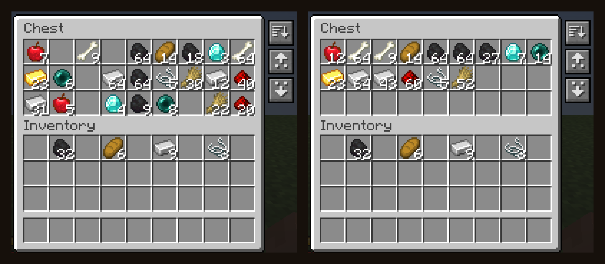

  

  <picture><source media="(prefers-color-scheme: dark)" srcset="https://shieldcn.dev/badge/Minecraft-1.21.11%20%C2%B7%2026.1.2%20%C2%B7%2026.2%20%C2%B7%2026.3-4ade80.svg?logo=lu:Pickaxe&amp;variant=secondary&amp;mode=dark" /></picture>
  <picture><source media="(prefers-color-scheme: dark)" srcset="https://shieldcn.dev/badge/Loaders-Fabric%20%C2%B7%20Forge%20%C2%B7%20NeoForge-5cd2ff.svg?logo=lu:Layers&amp;variant=secondary&amp;mode=dark" /></picture>
  <a href="https://modrinth.com/mod/amber"><picture><source media="(prefers-color-scheme: dark)" srcset="https://shieldcn.dev/badge/Requires-Amber-ebb134.svg?logo=lu:Gem&amp;variant=secondary&amp;mode=dark" /></picture></a>
  <a href="https://modrinth.com/mod/konfig"><picture><source media="(prefers-color-scheme: dark)" srcset="https://shieldcn.dev/badge/Requires-Konfig-a78bfa.svg?logo=lu:SlidersHorizontal&amp;variant=secondary&amp;mode=dark" /></picture></a>
  <a href="LICENSE"><picture><source media="(prefers-color-scheme: dark)" srcset="https://shieldcn.dev/badge/License-PolyForm%20Shield-eeeeee.svg?logo=lu:Scale&amp;variant=secondary&amp;mode=dark" /></picture></a>
  <a href="https://discord.gg/HV5WgTksaB"><picture><source media="(prefers-color-scheme: dark)" srcset="https://shieldcn.dev/discord/1207469438719492176.svg?variant=secondary&amp;mode=dark" /></picture></a>

Minisort puts three small buttons beside your chests, barrels, shulker boxes, and other storage. **Sort** tidies the container, **Deposit** puts away everything you're carrying that the container already holds, and **Retrieve** takes out more of what you already carry. Your inventory gets a Sort button too. When the stack in your hand runs out, the next matching stack from your inventory moves into its place.

## The buttons

Open a chest and the buttons sit to the right of it.

- **Sort** merges partial stacks and puts the container in order. It only touches the container; your inventory stays as it is.
- **Deposit** moves every stack from your inventory, hotbar included, whose item is already in the container. Your sword stays with you, your extra cobblestone goes into the cobblestone chest.
- **Retrieve** pulls every stack from the container whose item you already carry. Bring one torch, and the chest's torches come back with you.

Hold **Shift** and Deposit and Retrieve move everything instead. Shift-Deposit empties your main inventory into the chest and leaves your hotbar alone. Shift-Retrieve takes everything that fits, filling your main inventory before your hotbar. Hover any button to see what it does.

  

The buttons show up on chests, barrels, ender chests, shulker boxes, dispensers, droppers, and hoppers. Crafting tables, furnaces, anvils, villagers, and other special screens are left alone.

## Sorting your inventory

Your own inventory has a Sort button too, beside the inventory screen. It sorts the 27 main slots and never touches your hotbar.

You can also middle-click any slot to sort the side it belongs to: a slot in the chest sorts the chest, a slot in your inventory sorts your inventory. In Creative mode, middle-click keeps its vanilla job of copying items.

## Sort order

By default, Sort orders items by their ID, which groups them by mod and then by name.

There's also an experimental **Categories** mode. It groups blocks, tools, combat gear, armor, food, potions, materials, and spawn eggs. Blocks of one material stay together, so oak logs, planks, stairs, and doors sit side by side. Tools and armor go in tier order, and colored items follow dye order.

## Hand refill

When a stack in your main hand or offhand runs out, Minisort refills it from your inventory:

- the last block you placed
- the last food or drink
- the last ender pearl, snowball, bone meal, or spawn egg you used
- a tool that just broke

The replacement has to match exactly, enchantments and names included. Tools are the one exception: a worn copy of the same tool counts. Refill looks through your hotbar first and then the rest of your inventory. It never takes from shulker boxes, bundles, or the chest you have open.

Dropping an item or putting on armor never triggers a refill, and Creative mode doesn't refill at all.

## Settings

Open Minisort's settings from your loader's mod list. On Fabric, install [Mod Menu](https://modrinth.com/mod/modmenu) to add the configuration button.

- **Sort Mode** and the button positions are your own, so everyone on a server can pick differently.
- **Hand Refill** settings come from the server. Blocks, broken tools, food and drinks, and other right-click items can each be turned off. Turn off **Search Hotbar First** to keep your hotbar layout intact.

## Installation

Minisort needs [Amber](https://modrinth.com/mod/amber) and [Konfig](https://modrinth.com/mod/konfig). On Fabric it also needs [Fabric API](https://modrinth.com/mod/fabric-api). Install it on both the client and the server; sorting, moving items, and refilling all happen on the server.

It supports Fabric, Forge, and NeoForge on Minecraft 1.21.11, 26.1.2, 26.2, and 26.3. Older versions will follow.

## Artifacts

Loader-specific jars are the default publication format. One merged jar per
Minecraft version can also be built with `just horizontal-jars`.

Merged jars for 26.1.2, 26.2, and 26.3 preserve stable common class names.
Merged jars for 1.21.11 are experimental: they can relocate common classes or
loader metadata, which may break addons and mixins that target Minisort
internals. Use loader-specific jars on 1.21.11 when compatibility is
important.
