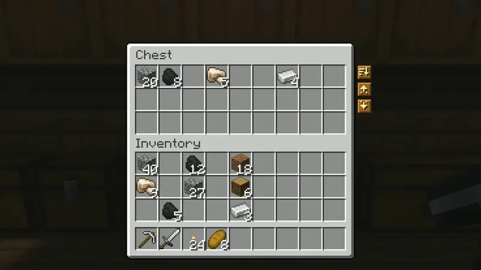
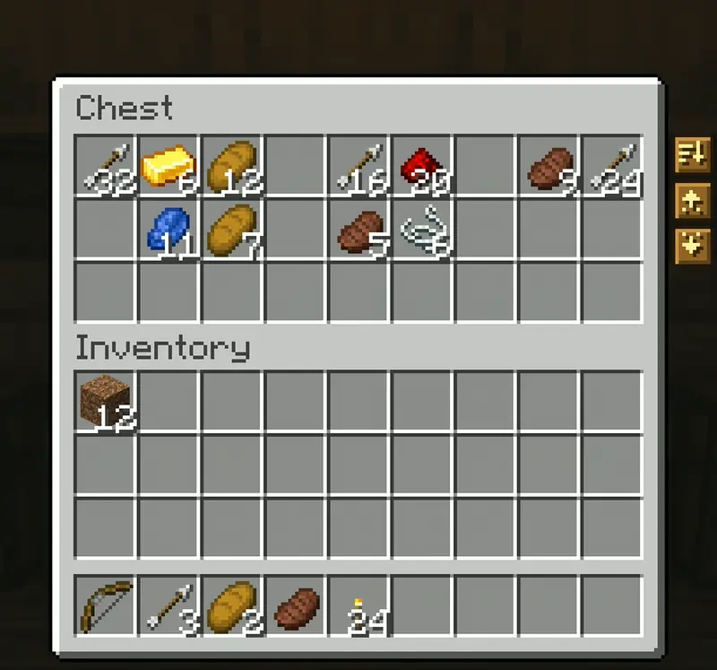
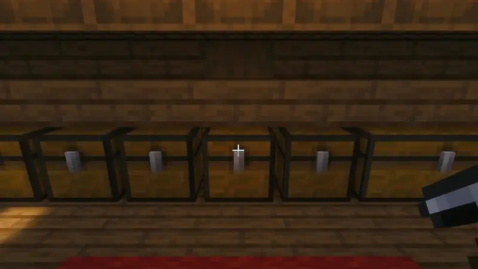
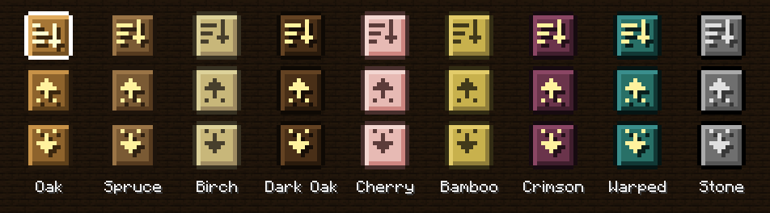
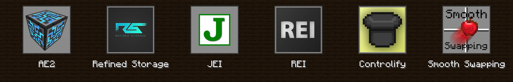
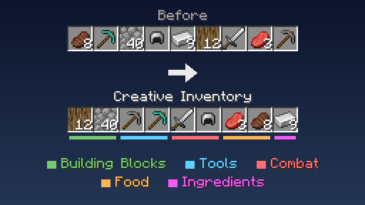
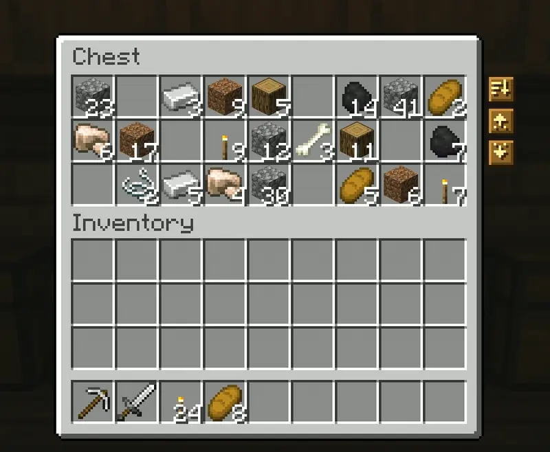
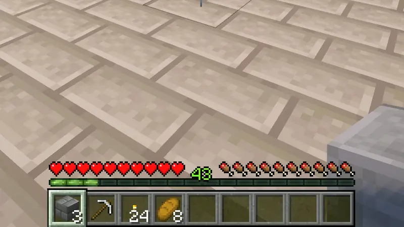
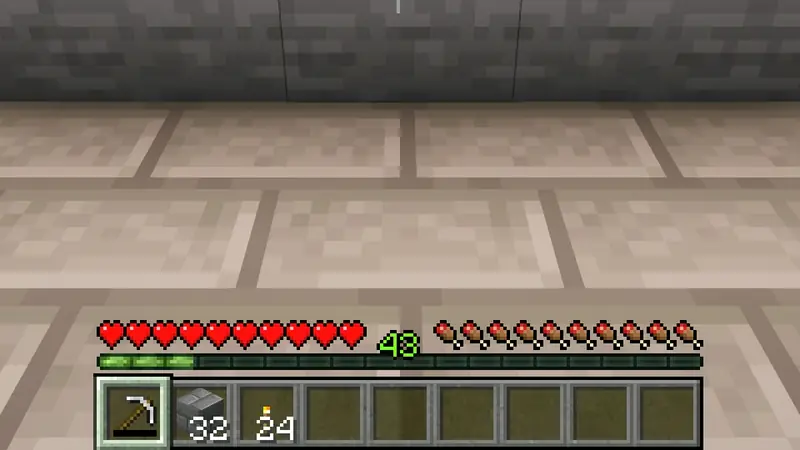

  

  <picture><source media="(prefers-color-scheme: dark)" srcset="https://shieldcn.dev/badge/Minecraft-1.21.11%20%C2%B7%2026.1.2%20%C2%B7%2026.2%20%C2%B7%2026.3-4ade80.svg?logo=lu:Pickaxe&amp;variant=secondary&amp;mode=dark" /></picture>
  <picture><source media="(prefers-color-scheme: dark)" srcset="https://shieldcn.dev/badge/Loaders-Fabric%20%C2%B7%20Forge%20%C2%B7%20NeoForge-5cd2ff.svg?logo=lu:Layers&amp;variant=secondary&amp;mode=dark" /></picture>
  <a href="https://modrinth.com/mod/amber"><picture><source media="(prefers-color-scheme: dark)" srcset="https://shieldcn.dev/badge/Requires-Amber-ebb134.svg?logo=lu:Gem&amp;variant=secondary&amp;mode=dark" /></picture></a>
  <a href="https://modrinth.com/mod/konfig"><picture><source media="(prefers-color-scheme: dark)" srcset="https://shieldcn.dev/badge/Requires-Konfig-a78bfa.svg?logo=lu:Settings2&amp;variant=secondary&amp;mode=dark" /></picture></a>
  <a href="LICENSE"><picture><source media="(prefers-color-scheme: dark)" srcset="https://shieldcn.dev/badge/License-PolyForm%20Shield-eeeeee.svg?logo=lu:Scale&amp;variant=secondary&amp;mode=dark" /></picture></a>
  <a href="https://discord.gg/HV5WgTksaB"><picture><source media="(prefers-color-scheme: dark)" srcset="https://shieldcn.dev/discord/1207469438719492176.svg?variant=secondary&amp;mode=dark" /></picture></a>

Minisort adds **Sort**, **Deposit**, and **Retrieve** buttons to your storage screens, plus a **Sort** button for your inventory. Use them to tidy a chest, unload what you've been carrying, or grab more supplies. When a stack runs out or a tool breaks, hand refill finds a matching replacement in your inventory. Modded storage works too, with support for JEI, REI, and Controlify.

## Using the storage buttons

Open a chest to find three buttons on its right side.

Click **Sort** to merge partial stacks and put the chest in order. It only sorts the chest; everything in your inventory keeps its place.

  

Click **Deposit** to unload items that are already in the chest. For example, a chest containing cobblestone will take the cobblestone from your main inventory. Deposit skips your hotbar.

  

Click **Retrieve** to take more of the items you're carrying. If you have a torch in your inventory, Retrieve pulls torches from the chest until there's no room for more.

  

Hold **Shift** to transfer items without checking for matches. **Shift-Deposit** empties your main inventory into the chest as far as space allows, still skipping the hotbar. **Shift-Retrieve** takes anything the chest holds, filling your main inventory before your hotbar. Hover over a button to read what it does.

  

These buttons work in chests, ender chests, barrels, shulker boxes, dispensers, droppers, and hoppers. You won't see them in crafting, furnace, repair, or trading screens, or other menus used for similar tasks.

## Choosing a button style

The settings offer nine styles: Oak, Spruce, Birch, Dark Oak, Cherry, Bamboo, Crimson, Warped, and Stone. Hovering over a button gives it a little animation.

  

## Modpack support

  

- **Modded storage.** Chests and storage blocks from other mods can use all three buttons. Minisort checks the slots to recognize storage, so each mod doesn't need its own patch. Fuel, upgrade, and other special slots are excluded from transfers and sorting. Machine menus, crafting grids, and AE2 or Refined Storage terminals keep their existing buttons and middle-click behavior. To hide Minisort's buttons in a particular menu, put its ID in the **Turned Off In** setting.
- **Creative tabs set the order.** By default, modded items take their place according to their creative tabs rather than all ending up after the vanilla items.
- **JEI and REI** move their item lists and bookmarks out of the buttons' way. This support is available on Fabric and NeoForge.
- **Controlify** lets you sort by pressing the right stick. It sorts the side your cursor points to, or the container otherwise. You can also snap the cursor to the buttons and use Controlify's Shift input for Deposit and Retrieve without the matching filter. Controlify is available for Fabric and NeoForge.
- **Smooth Swapping** handles the item animations if you have it installed.
- **Joining a server without Minisort** works as usual. Minisort hides its buttons on that server.
- **Fabric, Forge, and NeoForge** use the same jar for a given Minecraft version.

  

## Inventory sorting and shortcuts

Open your inventory and click **Sort** to organize its 27 main slots. Your hotbar keeps the arrangement you chose.

  

You can also middle-click a slot: a storage slot sorts the container, while a player inventory slot sorts your main inventory. In Creative mode, middle-click still copies items as it does in vanilla.

Press **R**, the default **Sort** key, to sort the inventory or storage beneath your cursor. If you aren't pointing at a slot, it sorts the open container. You can assign another key in Controls.

## How items are ordered

The default sorting order comes from the creative inventory. Building blocks lead, followed by colored blocks, natural blocks, tools, combat gear, food, and ingredients. Modded items use their creative tabs for placement, and items missing from those tabs are placed with related items.

For alphabetical sorting by item ID, set the sort mode to **Registry ID**. This groups items by mod.

  

## Watching items move

Items slide between slots when you use Sort, Deposit, or Retrieve. The movement takes about a tenth of a second; stacks that merge meet in their destination slot. These animations apply to Minisort actions, leaving ordinary clicks and sorting by other mods unchanged. Disable **Item Animation** if you prefer items to move instantly.

  

## Replacing empty stacks and broken tools

With hand refill, Minisort checks for a matching item in your inventory when something in either hand runs out. That happens when you:

- use the last block you're holding
- eat or drink the last item in a stack
- run out of ender pearls, snowballs, bone meal, or spawn eggs while using them
- wear out a tool

  

  

A replacement needs the same name, enchantments, and other item data. For tools, the amount of durability left can differ. Minisort checks your hotbar first by default, then your main inventory. It can only use items in those slots, so supplies inside a bundle, shulker box, or open container won't refill your hand.

Hand refill is off in Creative mode. Dropping an item or putting on armor doesn't trigger a replacement.

## Changing the settings

  

Open Minisort's settings from your mod list. On Fabric, install [Mod Menu](https://modrinth.com/mod/modmenu) to access that screen.

- Player settings include **Sort Mode**, **Item Animation**, **Button Style**, and **Turned Off In**. Choose from eight wood styles or Stone, and list any menus where you want the buttons hidden.
- Server settings control **Hand Refill**. Blocks, broken tools, food and drinks, and other right-click items each have their own switch. Turn off **Search Hotbar First** to check the main inventory for replacements before the other hotbar slots.

## Installing Minisort

You'll need Minisort, [Amber](https://modrinth.com/mod/amber), and [Konfig](https://modrinth.com/mod/konfig) on both your client and the server. For Fabric, also install [Fabric API](https://modrinth.com/mod/fabric-api). Sorting, transfers, and hand refill run on the server. If a server doesn't have Minisort, you can join it, but the buttons won't appear.

Choose the download for your Minecraft version: 1.21.11, 26.1.2, 26.2, or 26.3. It works with Fabric, Forge, and NeoForge. Older Minecraft versions are planned too.

## Building jars and using Minisort in addons

Modrinth and CurseForge offer a combined jar for each Minecraft version, usable
on all three loaders. Run `just horizontal-jars` to build these jars. For a jar
targeting a single loader, use [Kaf Maven](https://maven.kaf.sh).

On 26.1.2, 26.2, and 26.3, class names stay the same in the combined jar.
The 1.21.11 build gives shared classes different names for each loader. If your
addon or mixin uses Minisort's internals on that version, build against the jar
for your loader.
