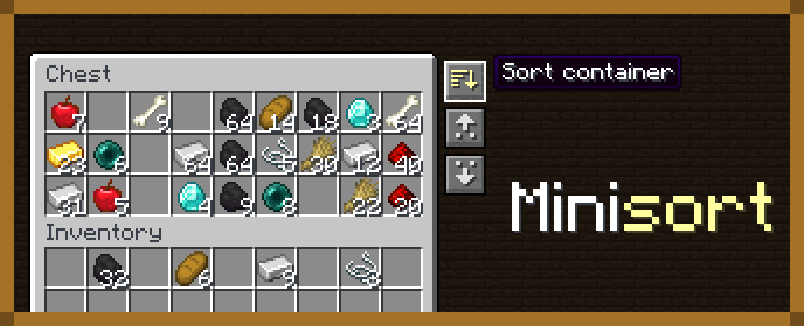

# Minisort

Minisort adds three compact buttons to normal Minecraft storage screens and
refills an emptied hand from matching inventory stacks. Everything runs on the
logical server and preserves item components.

## Container buttons

- **Sort** merges partial stacks and orders the container.
- **Deposit** moves every stack from your inventory, hotbar included, whose item
  is already in the container.
- **Retrieve** pulls every stack from the container whose item you already
  carry.

Sorting orders by registry ID by default, which groups items by mod and then by
name. The experimental **Categories** mode groups blocks, tools, combat gear,
armor, food, potions, materials, and spawn eggs, then keeps building blocks of
one material together, tools and armor in tier order, and colors in dye order.
Each player picks a mode in the client config. Button positions are
configurable too.

## Supported storage

- Chests and barrels
- Shulker boxes
- Dispensers and droppers
- Hoppers

Special-purpose menus such as crafting tables, anvils, grindstones, merchants,
enchanting tables, looms, and stonecutters are intentionally left untouched.
Player-inventory sorting is not part of the initial release.

## Refill behavior

- Exact item-component matching for blocks and consumables.
- Tool replacement ignores durability damage but preserves every other
  component.
- Main-hand and off-hand refill support.
- Configurable feature categories and inventory search order.
- No shulker-box, bundle, armor-slot, cursor-stack, or open-container scans.

Other right-click items, such as ender pearls, bone meal, and spawn eggs, refill
too. Refill only reacts to item-use and durability events; dropping an item or
equipping armor from your hand does not trigger a refill.

## Requirements

Minisort requires [Amber](https://modrinth.com/mod/amber) and
[Konfig](https://modrinth.com/mod/konfig).

The mod supports Fabric, Forge, and NeoForge on Minecraft 1.21.11, 26.1.2,
26.2, and 26.3.

## Artifacts

Loader-specific jars are the default publication format. One merged jar per
Minecraft version can also be built with `just horizontal-jars`.

Merged jars for 26.1.2, 26.2, and 26.3 preserve stable common class names.
Merged jars for 1.21.11 are experimental: they can relocate common classes or
loader metadata, which may break addons and mixins that target Minisort
internals. Use loader-specific jars on 1.21.11 when compatibility is
important.
